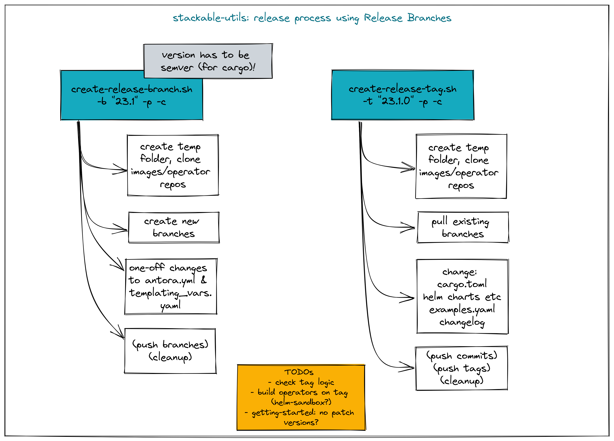

# Release scripts

A set of scripts that automates some release steps. The release process has multiple steps:

1. Call `create-release-branch.sh`- This will:

- create a temporary folder
- clone operator and image repositories
- create a new release branch for each repository

2. Test and fix things in the release branches

- changes should be done by making changes in the main branch and then cherry-picking these changes back into the release branch

3. Call `create-release-tag.sh`- This will:

- checks that the appropriate release branch exists
- switch to the previously-created release branch in each repository
- conduct code refactoring
- commit and tag these changes
- push the resulting commits and tags, triggering github actions to build the product images and operators

4. Call `post-release.sh`- This will:

- update the operator CHANGELOG.md in `main` with changes from the release tag
- create PRs for all operators

## Install requirements

### cargo-edit plugin

The `cargo-edit` plugin is used to update operator versions in `cargo` workspaces.

Install it like this:

[source,bash]
----
cargo install cargo-edit --version 0.11.11
----

### yq (yaml parser)

This script requires https://github.com/mikefarah/yq (not to be confused with https://github.com/kislyuk/yq).

### gh (github client)

This script requires https://github.com/cli to be installed.
You have to be logged in when running the `post-release.sh` script. The easiest way is to have a local env variable `GH_TOKEN` set to a classic token created via https://github.com/settings/tokens with all `repo` and all `admin:org` scopes or follow the login instructions here https://cli.github.com/manual/gh_auth_login.

## Usage

### Release branches

To create release branches use the `create-release-branch.sh` script, called from the repository root folder. The syntax is given below:

[source]
----
./release/create-release-branch.sh -b <release> [-p] [-c] [-w products|operators|both]
----

- `-b <release>`: the release number (mandatory). This must be a semver-compatible value (i.e. without leading zeros) such as `23.1`, `23.10` etc. and will be used to create a branch with the name `release-<release>` e.g. `release-23.1`
- `-p`: push flag (optional, default is "false"). If provided, the created branches plus any changes made as part of this process will be pushed to the origin.
- `-c`: cleanup flag (optional, default is "false"). If provided, the repository folders will be torn down on completion.
- `-w`: where to create the branch. It can be "products", "operators", "both".

N.B. the flags cannot be combined (e.g. `-p -c` but not `-pc)

e.g.

[source]
----
./release/create-release-branch.sh -b 23.1 -p -c -w both
----

#### What this script does

* checks that the release argument is valid (e.g. semver-compatible, just major/minor levels)
* strips this argument of any leading or trailing quote marks
* for docker images
** creates or updates a temporary folder with clones of the images repository (given in `config.yaml`)
** creates the new branch according to the release version
** pushes the new branch (if requested with "-p")
** deletes the temporary folder (if requested with "-c")
* for operators:
** iterates over a list of operator repository names (listed in `config.yaml`), and for each one:
** clones or updates operator and product images repositories
** creates the new branch according to the release version
** pushes the new branch (if requested with "-p")
** deletes the temporary folder (if requested with "-c")

### Release tags

To create release tags use the `create-release-tag.sh` script, called from the repository root folder. The syntax is given below:

[source]
----
./release/create-release-tag.sh -t <release-tag> [-p] [-c] [-w products|operators|both]
----

- `-t <release-tag>`: the release tag (mandatory). This must be a semver-compatible value (i.e. major/minor/path, without leading zeros) such as `23.1.0`, `23.10.3` etc. and will be used to create a tag with the name
- `-p`: push flag (optional, default is "false"). If provided, the created commits and tags made as part of this process will be pushed to the origin.
- `-c`: cleanup flag (optional, default is "false"). If provided, the repository folders will be torn down on completion.
- `-w`: where to create the tag and update versions in code. It can be "products", "operators", "both".

N.B. the flags cannot be combined (e.g. `-p -c` but not `-pc)

e.g.

[source]
----
./release/create-release-tag.sh -t 23.1.0 -p -c -w both
----

#### What this script does

* checks that the release argument is valid (e.g. semver-compatible, major/minor/patch levels)
* for docker images:

** tags the branch and pushes it if the push argument is provided
* for operators:
** checks that the release branch exists and the tag doesn't
** adapts the versions in all cargo.toml to `release-tag` argument
** update all "stackableVersion" fields in the kuttl tests
** update the antora.yaml
** update the  `release-tag` in helm charts
** updates the cargo workspace
** rebuilds the helm charts
** bumps the changelog
** creates a tagged commit in the branch (i.e. the changes are valid for the branch lifetime)
** pushes the commit and tag (if requested with "-p")
** deletes the temporary folder (if requested with "-c")

### Post-release steps

Some post release steps are performed with `release/post-release.sh` script, called from the repository root folder. The syntax is given below:

[source]
----
./release/post-release.sh -t <release-tag> [-p]
----

- `-t <release-tag>`: the release tag (mandatory). This must be a semver-compatible value (i.e. major/minor/path, without leading zeros) such as `23.1.0`, `23.10.3` etc. and will be used to create a tag with the name
- `-p`: push flag (optional, default is "false"). If provided, the created commits and tags made as part of this process will be pushed to the origin.

#### What this script does

* checks that the release tag exists and that the all operator repositories have a clean working copy
* merges the CHANGELOG.md from the release tag into main
* creates PRs for all operators

#### Build actions

When a tag is pushed, the images for products and operators are built via github actions. The following points should be noted:

##### Product images

The build action script `release.yml` builds all product images that defined in the `release.yaml` matrix section:

[source, yaml]
----

name: Release product images
on:
  push:
    tags:
      - '[0-9][0-9].[0-9]+.[0-9]+'

jobs:
  ...
  strategy:
    fail-fast: false
    # If we want more parallelism we can schedule a dedicated task for every tuple (product, product version)
    matrix:
      product:
        # N.B. exclude base images!
        - airflow
        - zookeeper
        ...
----

Base images should be excluded from the build action as they need to be referenced by their manifest hashes in the product Dockerfiles and therefore should be built independently of the product images.

Also note that the tag pattern above is not using a regex (this functionality is not available for tag filtering) but uses glob-operators. The check is not totally watertight - we cannot for example enforce the "minor" version of the release to be limited to a digit between 1 and 12 - but this check is covered by the calling script `create-release-tag.sh`.

##### Operator images

Operator images are built by iterating over and pushing tags for the operator-repositories listed in the `operators` section of `config.yaml`:

[source, yaml]
----
images-repo: docker-images
  operators:
    - airflow
    - secret
    - commons
    - ...
----

### Bugfix/patch tags

To create release tags for bugfix/patch releases use the `create-bugfix-tag.sh` script, called from the repository root folder. The syntax is given below:

[source]
----
./release/create-bugfix-tag.sh -t <release-tag> [-p] [-c] [-w products|operators|both] [-i]
----

- `-t <release-tag>`: the release tag (mandatory). This must be a semver-compatible value (i.e. major/minor/path, without leading zeros) such as `23.1.0`, `23.10.3` etc. and will be used to create a tag with the name
- `-p`: push flag (optional, default is "false"). If provided, the created commits and tags made as part of this process will be pushed to the origin.
- `-c`: cleanup flag (optional, default is "false"). If provided, the repository folders will be torn down on completion.
- `-w`: where to create the tag and update versions in code. It can be "products", "operators", "both".
- `-i`: product image versioning flag (optional, default is "false"). If provided, updates test definitions with product image versions from this release version (i.e. assumes products have been released/tagged, too).

N.B. the flags cannot be combined (e.g. `-p -c` but not `-pc)

e.g.

[source]
----
./release/create-bugfix-tag.sh -t 23.1.0 -p -c -w both -i
----

#### What this script does

* checks that the release argument is valid (e.g. semver-compatible, major/minor/patch levels)
* strips this argument of any leading or trailing quote marks
* for docker images
** creates a temporary folder with clones of the images repository (given in `config.yaml`)
** clones the docker images repository
** checks that the release branch exists and the tag doesn't
** switches to the release branch
** tags the branch and pushes it if the push argument is provided
** deletes the temporary folder (if requested with "-c")
* for operators:
** iterates over a list of operator repository names (listed in `config.yaml`), and for each one:
** clones the operator repositories
** checks that the release branch exists and the tag doesn't
** switches to the release branch
** updates crate versions and the workspace
** updates test definitions to use product image versions that match the release tag (if requested with "-i")
** tags the branch and pushes it if the push argument is provided
** deletes the temporary folder (if requested with "-c")

## Troubleshooting

This section collects problems and errors that happened on different platforms.

### create-release-tag.sh

#### yq stat file not found

If you installed `yq` via snap there is a strict confinement which means it does not have direct access to root files. The scripts provided here use the `/tmp` folder to check out and adapt branches.

You can adapt the `/tmp` folder in  `TEMP_RELEASE_FOLDER` in the `create-release-branch.sh`, `create-release-tag.sh` and `post-release.sh` scripts to a path in your home folder (do not commit this change!) or follow instructions provided here see https://github.com/mikefarah/yq#snap-notes.

#### missing libraries

When building the secret-operator some libraries may be missing. See https://docs.stackable.tech/home/stable/secret-operator/building#_local_builds[secret-operator local builds] for requirements):
