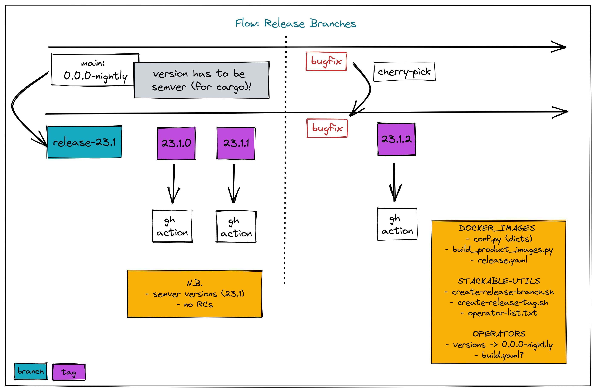

# Release scripts

A set of scripts that automates some release steps. The release process has three steps:

1. Call `create-release-branch.sh`- This will:

- create a temporary folder
- clone operator and image repositories
- create a new release branch for each repository

2. Test and fix things in the release branches

- changes should be done by making changes in the main branch and then cherry-picking these changes back into the release branch

3. Call `create-release-tag.sh`- This will:

- create a temporary folder
- clone operator and image repositories
- switch to the previously-created release branch in each repository
- conduct code refactoring
- commit and tag these changes
- push the resulting commits and tags, triggering github actions to build the product images and operators

These steps are summarised in the two diagrams below:

image::images/rb-utils.png[]

## Install requirements

### Python 3

A working python 3 installation is required by the `cargo-version.py` script.

Install required packages:

[source]
----
pip install -r release/requirements.txt
----

### yq (yaml parser)

This script requires https://github.com/mikefarah/yq (not to be confused with https://github.com/kislyuk/yq)

## Usage

### Release branches

To create release branches use the `create-release-branch.sh` script. The syntax is given below:

[source]
----
./release/create-release-branch.sh -b <release> [-p] [-c]
----

- `-b <release>`: the release number (mandatory). This must be a semver-compatible value (i.e. without leading zeros) such as `23.1`, `23.10` etc. and will be used to create a branch with the name `release-<release>` e.g. `release-23.1`
- `-p`: push flag (optional). If provided, the created branches plus any changes made as part fo this process will be pushed to the origin.
- `-c`: cleanup flag (optional). If provided, the repository folders will be torn down on completion.

N.B. the flags cannot be combined (e.g. `-p -c` but not `-pc)

e.g.

[source]
----
./release/create-release-branch.sh 23.1 -p -c
----

#### What this script does

* checks that the release argument is valid (e.g. semver-compatible, just major/minor levels)
* strips this argument of any leading or trailing quote marks
* for docker images
** creates a new folder in a temporary folder and clones the images repository (given in `config.yaml`)
** creates a new branch (and pushes it if the push argument is provided)
** deletes the branch if the cleanup flag is provided
* for operators:
** iterates over a list of operator repository names (listed in `config.yaml`), and for each one:
** creates a new folder in a temporary folder and clones the operator repository
** creates a new branch
** creates a one-off commit in the branch (i.e. the changes are valid for the branch lifetime)
** pushes the commit if the push argument is provided
** deletes the temporary folder if the cleanup flag is provided

### Release tags

To create release tags use the `create-release-tag.sh` script. The syntax is given below:

[source]
----
./release/create-release-branch.sh -t <release-tag> [-p] [-c]
----

- `-t <release-tag>`: the release tag (mandatory). This must be a semver-compatible value (i.e. major/minor/path, without leading zeros) such as `23.1.0`, `23.10.3` etc. and will be used to create a tag with the name
- `-p`: push flag (optional). If provided, the created commits and tags made as part of this process will be pushed to the origin.
- `-c`: cleanup flag (optional). If provided, the repository folders will be torn down on completion.

N.B. the flags cannot be combined (e.g. `-p -c` but not `-pc)

#### What this script does

* checks that the release argument is valid (e.g. semver-compatible, major/minor/patch levels)
* strips this argument of any leading or trailing quote marks and derives the corresponding branch name
* for docker images:
** creates a new folder in a temporary folder and clones the images repository (given in `config.yaml`)
** switches to the release branch
** tags the branch and pushes it if the push argument is provided
* for operators:
** iterates over a list of operator repository names (listed in `config.yaml`), and for each one:
** creates a new folder in a temporary folder and clones the operator repository
** switches to the release branch
** makes the following changes:
*** adapts the versions in all cargo.toml to `release-tag` argument
*** adapts the versions in all helm charts to `release-tag` argument
*** updates the workspace
*** rebuilds the helm charts
*** bumps the changelog
*** adapts the versions in CRDs in the getting started section to `release-tag` argument
*** runs the templating script to propagate changes to script files
** creates a tagged commit in the branch (i.e. the changes are valid for the branch lifetime)
** pushes the commit and tag if the push argument is provided
** deletes the temporary folder if the cleanup flag is provided

#### Build actions

When a tag is pushed, the images for products and operators are built via github actions. The following points should be noted:

##### Product images

The build action script `release.yml` builds all product images that exist in the docker-images repository, with an explicit filtering provided by the following `matrix` section:

[source, yaml]
----

name: Release product images
on:
  push:
    tags:
      - '[0-9][0-9].[0-9]+.[0-9]+'

jobs:
  ...
  strategy:
    fail-fast: false
    # If we want more parallelism we can schedule a dedicated task for every tuple (product, product version)
    matrix:
      product:
        # N.B. exclude base images!
        - airflow
        - zookeeper
        ...
----

Base images should be excluded from the build action as they need to be referenced by their manifest hashes in the product Dockerfiles and therefore should be built independently of the product images.

Also note that the tag pattern above is not using a regex (this functionality is not available for tag filtering) but uses glob-operators. The check is not totally watertight - we cannot for example enforce the "minor" version of the release to be limited to a digit between 1 and 12 - but this check is covered by the calling script `create-release-tag.sh`.

##### Operator images

Operator images are built by iterating over and pushing tags for the operator-repositories listed in the `operators` section of `config.yaml`:

[source, yaml]
----
images-repo: test-platform-release-images #docker-images
  operators:
    - test-platform-release-zk
    #- airflow
    #- secret
    #- commons
----
