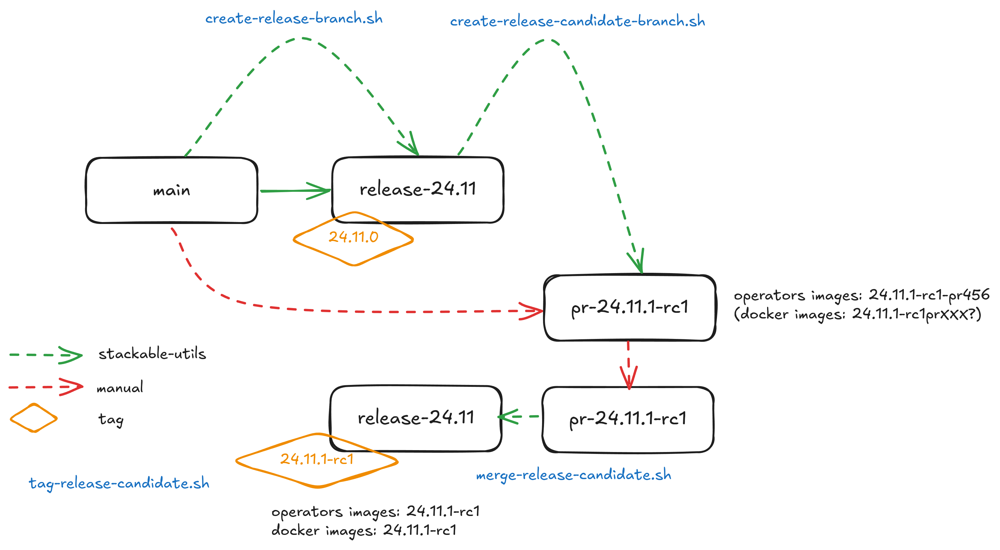
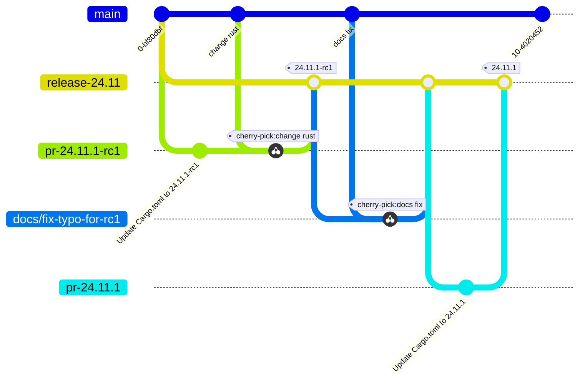

# Release workflow

This is the recommended release flow in a nutshell for the release 25.3.
These steps are repeated for each release tag i.e. for both release-candidates and non-release-candidates:

```shell
# start with the product images ...
# create and push the release branch
./release/create-release-branch.sh -b 25.3 -w products # Only add the -p flag after testing locally first

# create a new PR dedicated to the current release tag
./release/create-release-candidate-branch.sh -t 25.3.0-rc1 -w products # Only add the -p flag after testing locally first

# merge the PR branches, once the necessary changes have been made (e.g. cherry-picked from main)
./release/merge-release-candidate.sh -t 25.3.0-rc1 -w products # Only add the -p flag after testing locally first

# tag the merge commit
./release/tag-release-candidate.sh -t  25.3.0-rc1 -w products # Only add the -p flag after testing locally first

# monitor the GH action that builds ~80 images for success.
# build failures alerts will appear in the #notifications-container-images channel.
# repeat the above with e.g. the tag 25.3.0 once a release candidate is accepted.

# continue with the operators ...
# create and push the release branch
./release/create-release-branch.sh -b 25.3 -w operators # Only add the -p flag after testing locally first

# create a new PR dedicated to the current release tag
./release/create-release-candidate-branch.sh -t 25.3.0-rc1 -w operators # Only add the -p flag after testing locally first

# merge the PR branches, once the necessary changes have been made (e.g. cherry-picked from main)
./release/merge-release-candidate.sh -t 25.3.0-rc1 -w operators # Only add the -p flag after testing locally first

# tag the merge commit
./release/tag-release-candidate.sh -t  25.3.0-rc1 -w operators # Only add the -p flag after testing locally first

# monitor the GH actions that build the operator images for success
# build failures are not yet sent to the #notifications-container-images channel yet.
# repeat the above with e.g. the tag 25.3.0 once a release candidate is accepted.

# continue with the demos ...
# create and push the release branch
./release/create-release-branch.sh -b 25.3 -w demos # Only add the -p flag after testing locally first

# finally - i.e. when a release candidate ahs been accepted and the actual release has been tagged - patch the changelog file in the main branch
# create PRs for all operators
./release/post-release.sh -t 25.3.0 # Only add the -p flag after testing locally first

# and that is it!
# (now the tedious post release steps start ...)
```

## Flow Overview



### Flow for a patch release to an existing release-branch



> [!NOTE]
> Once a release candidate has been merged, the subsequent Antora build will reference the most recent commit. This means that some references may be to an `-rc` release e.g. `25.3.0-rc1`. This can be avoided by 
> - conducting all testing on the PR-specific images that are created as part of the release candidate branches, instead of waiting until they have been merged and the commits tagged
> - once tests are successful, create a *non* `-rc` branch (e.g. `25.3.0`, `25.3.1` etc), cherry-picking over any changes that were made in the course of testing in the previous step, test, merge and tag
> - this will require the `release.yaml` file for each operator to be changed to specify PR-specific versions of the operators, and for `test-definition.yaml`to be edited to use custom images (as product iamge selection will not identify PR-specific images automatically).

## Release scripts: Summary

A set of scripts that automates some release steps. The release process has multiple steps:

1. Call `create-release-branch.sh`- This will:
  - create a temporary folder
  - clone operator and image repositories
  - create a new release branch for each repository
2. Call `create-release-candidate-branch.sh` - This will:
  - conduct code refactoring
  - create a tag-specific branch and PR based on the release branch
3. Call `merge-release-candidate.sh` - This will:
  - approve and merge the PR into the release branch
4. Call `tag-release-candidate.sh` - This will:
  - tag merge commit from above, triggering github actions to build the product images and operators
5. Call `post-release.sh`- This will:
  - update the operator CHANGELOG.md in `main` with changes from the release tag
  - create PRs for all operators

### N.B. 

- Steps 2-4 will check out the release branch (or clone it if does exist locally) and so can be run independently of each other.
- Any changes should be done manually between steps 2 and 3 i.e. by making changes in the PR branch and/or cherry-picking commits from main.

## Install requirements

> [!NOTE]
> Nix users will not need to install anything, just enter the `nix-shell` in this repository (if not done automatically via `direnv`).
> The dependencies will install automatically.
> A nix-shell will be entered for each operator during certain commands, so operator dependencies will be covered too.

### cargo-edit plugin

The `cargo-edit` plugin is used to update operator versions in `cargo` workspaces.

Install it like this:

```shell
cargo install cargo-edit --version 0.12.3
```

### yq (yaml parser)

This script requires <https://github.com/mikefarah/yq> (not to be confused with <https://github.com/kislyuk/yq>).

### gh (github client)

This script requires <https://github.com/cli> to be installed.
You have to be logged in when running the `post-release.sh` script. The easiest way is to have a local env variable `GH_TOKEN` set to a classic token created via <https://github.com/settings/tokens> with all `repo` and all `admin:org` scopes or follow the login instructions here <https://cli.github.com/manual/gh_auth_login>.

### jinja2 (templating tool)

This script requires jinja2 as a templating tool. It can be installed like this:

```shell
pipx install jinja2-cli
pipx inject jinja2-cli pyyaml
```

## Usage

### 1.) Create release branches

To create release branches use the `create-release-branch.sh` script, called from the repository root folder. The syntax is given below:

```shell
./release/create-release-branch.sh -b <release> [-p] [-c] [-w products|operators|demos|all]
```

- `-b <release>`: the release number (mandatory). This must be a semver-compatible value (i.e. without leading zeros) such as `23.1`, `23.10` etc. and will be used to create a branch with the name `release-<release>` e.g. `release-23.1`.
- `-p`: push flag (optional, default is "false"). If provided, the created branches plus any changes made as part of this process will be pushed to the origin.
- `-c`: cleanup flag (optional, default is "false"). If provided, the repository folders will be torn down on completion.
- `-w`: where to create the branch. It can be "products", "operators", "demos" or "all".

N.B. the flags cannot be combined (e.g. `-p -c` but not `-pc)

e.g.

```shell
./release/create-release-branch.sh -b 23.1 -p -c -w all
```

#### What this script does

- checks that the release argument is valid (e.g. semver-compatible, just major/minor levels)
- creates or updates a temporary folder with clones of the images repository
- creates the new branch according to the release version
- optional: pushes the new branch (if requested with "-p")
- optional: deletes the temporary folder (if requested with "-c")

### 2.) Create PR branches for release candidates

To create release tags use the `create-release-candidate-branch.sh` script, called from the repository root folder. The syntax is given below:

```shell
./release/create-release-candidate-branch.sh -t <release-tag> [-p] [-c] [-w products|operators|all]
```

- `-t <release-tag>`: the release tag (mandatory). This must be a semver-compatible value (i.e. major/minor/path, without leading zeros) such as `23.1.0`, `23.10.3-rc1` etc. and will be used to create a tag with the name.
- `-p`: push flag (optional, default is "false"). If provided, the changes and PRs made as part of this process will be pushed to the origin.
- `-c`: cleanup flag (optional, default is "false"). If provided, the repository folders will be torn down on completion.
- `-w`: where to create the tag and update versions in code. It can be "products", "operators" or "all".

N.B. the flags cannot be combined (e.g. `-p -c` but not `-pc)

e.g.

```shell
./release/create-release-candidate-branch.sh -t 23.1.0-rc1 -p -c -w all
```

#### What this script does

- checks that the release argument is valid (e.g. semver-compatible, just major/minor levels)
- creates a temporary folder with clones of the images repository
- checks that the release branch exists and that the tag does not
- creates the new branch according to the release version
- performs code updates e.g.
  - adapts the versions in all cargo.toml to `release-tag` argument
  - update the antora.yaml
  - update the `release-tag` in helm charts
  - rebuilds the helm charts
  - bumps the changelog
- optional: pushes the new branch (if requested with "-p")
- optional: deletes the temporary folder (if requested with "-c")

The result of running this script will be a set of PRs specific to a given release (25.3.0, 25.7-rc1 etc.).
These PRs should eventually contain *all* changes relevant to the release (for a particular repository).
These changes can be pushed manually in the PR itself or cherry-picked from the `main` branch.
Product and operator images will be built when these PRs are created or updated, which means that integration tests can be run against these PRs (the image will be tagged e.g. airflow-operator:24.11.1-rc1).

### 3.) Approve/Merge PR branches for release candidates

To merge PRs use the `merge-release-candidate.sh` script, called from the repository root folder. The syntax is given below:

```shell
./release/merge-release-candidate.sh -t <release-tag> [-p] [-w products|operators|all]
```

- `-t <release-tag>`: the release tag (mandatory). This must be a semver-compatible value (i.e. major/minor/path, without leading zeros) such as `23.1.0`, `23.10.3-rc1` etc. and will be used to identify the PR (which was created using this tag).
- `-p`: push flag (optional, default is "false"). If provided, the PRs will be approved and merged.
- `-w`: where to create the tag and update versions in code. It can be "products", "operators" or "all".

e.g.

```shell
./release/merge-release-candidate.sh -t 23.1.0-rc1 -p -w all
```

#### What this script does

- checks that the release argument is valid (e.g. semver-compatible, just major/minor levels)
- checks that the PR status is `OPEN`
- if so, it approves and merges the PR
  - N.B. this approval step cannot be carried out by the same user that created the PR in the previous section
- optional: approves and merges the PRs (if requested with "-p")

### 4.) Tag release/release candidate

The final step is to tag the merge commit from above: this is done using the `tag-release-candidate.sh` script, called from the repository root folder. The syntax is given below:

```shell
./release/tag-release-candidate.sh -t <release-tag> [-p] [-c] [-w products|operators|all]
```

- `-t <release-tag>`: the release tag (mandatory). This must be a semver-compatible value (i.e. major/minor/path, without leading zeros) such as `23.1.0`, `23.10.3-rc1` etc. and will be used to create a tag with the name.
- `-p`: push flag (optional, default is "false"). If provided, the created commits and tags made as part of this process will be pushed to the origin.
- `-c`: cleanup flag (optional, default is "false"). If provided, the repository folders will be torn down on completion.
- `-w`: where to create the tag and update versions in code. It can be "products", "operators" or "all".

#### What this script does

- checks that the release argument is valid (e.g. semver-compatible, just major/minor levels)
- creates a temporary folder with clones of the images repository
- checks that the release branch exists and that the tag does not
- creates a tag for the release
- optional: pushes the new tag (if requested with "-p")
- optional: deletes the temporary folder (if requested with "-c")

### 5.) Post-release steps

Some post release steps are performed with `release/post-release.sh` script, called from the repository root folder. The syntax is given below:

```shell
./release/post-release.sh -t <release-tag> [-p] [-w products|operators|all]
```

- `-t <release-tag>`: the release tag (mandatory). This must be a semver-compatible value (i.e. major/minor/path, without leading zeros) such as `23.1.0`, `23.10.3` etc. and will be used to create a tag with the name.
- `-p`: push flag (optional, default is "false"). If provided, the created commits and tags made as part of this process will be pushed to the origin.
- `-w`: which repositories to update the changelogs for. It can be "products", "operators", "all" (defaults to "all").

#### What this script does

- checks that the release tag exists and that all operator repositories have a clean working copy
- checks that the release tag exists and that the docker-images repository has a clean working copy
- merges the CHANGELOG.md from the release tag into main
- creates PRs for all operators

## Build actions

When a tag is pushed, the images for products and operators are built via github actions. The following points should be noted:

### Product images

Product images are built when any tag is pushed. There exists a specific workflow for each product e.g. build_airflow.yaml, build_java-base.yaml etc.

```yaml
...
on:
  push:
    tags: ['*']
...
```

### Operator images

Operator images are built when a tag matching the tag pattern is pushed:

```yaml
...
on:
  push:
    tags:
      - '[0-9][0-9].[0-9]+.[0-9]+'
      - '[0-9][0-9].[0-9]+.[0-9]+-rc[0-9]+'
...
```

## Post-release steps

Once the release is complete and all steps above have been verified, the documentation needs to be updated and built. This is done in a separate suite of scripts found https://github.com/stackabletech/documentation/tree/main/scripts[here]. Follow the steps given in the two scripts (there are prompts provided which allow for early-exit if things are not as they should be!).

## Troubleshooting

This section collects problems and errors that happened on different platforms.

### create-release-candidate-branch.sh

#### yq stat file not found

If you installed `yq` via snap there is a strict confinement which means it does not have direct access to root files. The scripts provided here use the `/tmp` folder to check out and adapt branches.

You can adapt the `/tmp` folder in  `TEMP_RELEASE_FOLDER` in the `create-release-branch.sh`, `create-release-tag.sh` and `post-release.sh` scripts to a path in your home folder (do not commit this change!) or follow instructions provided here see https://github.com/mikefarah/yq#snap-notes.

#### missing libraries

When building the secret-operator some libraries may be missing. See: [secret-operator local builds](https://docs.stackable.tech/home/stable/secret-operator/building#_local_builds) for requirements.
